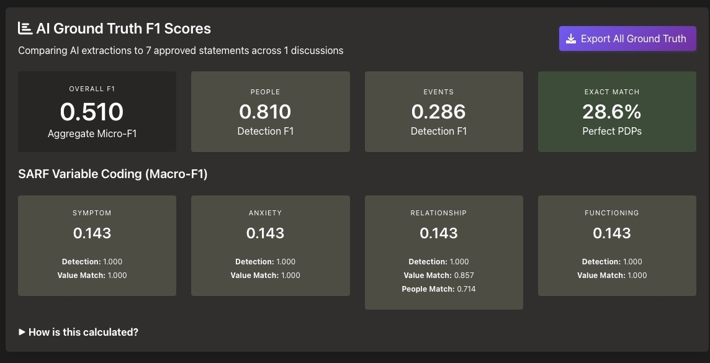

# BT Copilot

SARF (Symptom, Anxiety, Relationship, Functioning) is a novel clinical model, under test here, of instinctual reactivity in relationships, particularly family relationships, from an evolutionary-biology perspective. This repository is the research instrument: an AI coach that records a person's family as structured SARF data turn by turn, the expert coding and inter-rater reliability work that tests the model, and the F1 measurement of the machine's coding against expert ground truth.

The product built on it will live at [familydiagram.com](https://familydiagram.com).

Built by [Patrick Stinson](https://www.linkedin.com/in/patrickstinson/), who developed the clinical model.

## Novel Contributions to the Field

- [SARF Literature Review](doc/sarf-definitions/) - First exhaustive, 100% traceable literature review for Bowen Theory technical terms
- [SARF Data Model White Paper](https://docs.google.com/document/d/1k6ZvYEG1644L4SKqXzXoOvBnepmus2-8WwUfMh4R_4Y/edit?usp=sharing) - Novel clinical data model operationalizing Bowen theory constructs
- [Implicit Behavioral Model Synthesis](doc/archive/2026-09-plans/brainstorm-assessment/12_IMPLICIT_BEHAVIORAL_MODEL_SYNTHESIS.md) - Cross-validated theoretical framework synthesizing neuroscience, philosophy of mind, and clinical observation
- [Family Diagram Visual Specification](doc/FAMILY_DIAGRAM_VISUAL_SPEC.md) - Platform-independent specification for rendering Bowen family diagrams
- [Conversational Flow Evaluation](#phase-7-conversational-flow-evaluation-) - Objective metrics for measuring clinical interview quality
- [Inter-Rater Reliability Study](#phase-11-inter-rater-reliability-study) - First formal IRR study for family systems constructs at scale
- [Attachment and Big 5-Based Conversation Modeling & Measurement](#phase-12-attachment-and-big-5-based-conversation-modeling--measurement) - Synthetic client narratives structured by attachment style, with multi-dimensional clinical quality rubrics

**For engineers and recruiters:** [how the coach works](#how-the-coach-works) · [coach's agent loop](btcopilot/coachturn.py) · [the record and its tools](btcopilot/toolbox.py) · [oracle-derived tests](#the-human-oracle-and-its-tests) · [F1 measurement](#extraction-accuracy-f1) · [refusal fallback chain](btcopilot/llmutil.py#L232)

**For clinicians and researchers:** [SARF data model](doc/specs/DATA_MODEL.md) · [SARF literature review](#sarf-literature-review) · [inter-rater reliability findings](doc/irr/MEETING_FINDINGS.md) · [F1 results](#extraction-accuracy-f1) · [R&D roadmap: phases 1-13](#research-phases) · [research journal](#research-journal)

## How the Coach Works

One agent reads the conversation and decides each turn whether to ask, answer or change the record. The family record is its memory: the conversation is never rewritten, while the record changes as the person corrects it. The success measure is clinical, not a dataset: one or two correlations per person that change how they see their family. SARF took its first inspiration from Bowen family systems theory. The rules for when the timeline may be drawn and when the coach must ask are in [doc/DRAWABILITY.md](doc/DRAWABILITY.md).

The system is a Flask API with a Celery worker, Postgres, and a TypeScript page for phone and desktop. The diagram is a JSON document plus an append-only command log; one Python module mutates it, and the browser and the agent are clients of the same endpoint. `btcopilot.schema` is the one module other apps import, and it depends on nothing else in the package. Every model call is logged with its cost, and a refused turn falls back to an older model.

### The Human Oracle and Its Tests

Development answers to a human oracle: Patrick's rulings, each with an id (R-0001 and on), stored encrypted in `private/oracle/`. The open repo cites ruling ids and never restates them. No rubric or quality judgment is inferred without Patrick; he rules by example and by correcting proposed values.

Every test cites the ruling it checks, and a guard test enforces that. Every ruling has a citing test or a stated exception: owed where the behaviour is not built, waived where nothing observable could check it. Known defects are strict expected failures in [doc/KNOWN_DEFECTS.md](doc/KNOWN_DEFECTS.md). The strategy is in [doc/TEST_STRATEGY.md](doc/TEST_STRATEGY.md); the current state is in [doc/STATE.md](doc/STATE.md) and its derivation in [doc/HISTORY.md](doc/HISTORY.md).

## Extraction Accuracy (F1)

Best F1 per construct against expert-coded ground truth (six coded discussions). These were measured on the one-shot extraction of a whole conversation. The same measure continues on the new turn-by-turn coding once the inter-rater reliability group's ground truth exists.

| Construct | Best F1 | Configuration | Date |
|-----------|---------|---------------|------|
| People | 0.930 | Claude Fable 5 extraction, Gemini 3 Flash SARF review | 2026-06-09 |
| Pair-bonds | 0.832 | Gemini two-pass extraction | 2026-03-03 |
| Parent-child links | 0.815 | Gemini Flash plus parent inference from births | 2026-05-20 |
| Events | 0.617 | Claude Fable 5, extraction and SARF review | 2026-06-09 |
| SARF values (macro) | 0.621 | Claude Fable 5, extraction and SARF review (one run) | 2026-06-09 |
| Aggregate | 0.731 | Claude Fable 5, extraction and SARF review | 2026-06-09 |

Rows come from different model and matching versions, and the SARF-values row is a single run.

Per-statement extraction scored about 0.24 aggregate in late 2025, so whole-conversation extraction roughly tripled accuracy. Full tables: [F1 dashboard](doc/archive/2026-09-F1_DASHBOARD.md), [model evaluations](doc/archive/2026-09-MODEL_EVALUATIONS.md), [F1 over time](doc/archive/2026-09-f1_timeseries.html).

## Research Phases

Each phase enabled the next. The goal was automated prompt optimization against expert ground truth, then the same evaluation applied to training human clinicians.

### Phase 1: RAG for Questions on the Clinical Literature ✓

ChromaDB vector store indexes the clinical literature. LLM queries return relevant academic passages that constrain responses to established theory—prevents the model from inventing clinical concepts.

- NLTK-based semantic chunking with sentence boundary detection
- Metadata tracking (author, title, source file) for citation
### Phase 2: SARF Data Model & Schema ✓

The extraction target: a clinical coding scheme with Pydantic-validated JSON output.

The model centers on people and events. People have parents; events carry the variable shifts. How the relationship variable breaks down is where the novelty in SARF lies.

| Variable | What it captures |
|----------|------------------|
| **Symptom** | Physical/mental health changes, goal impediments |
| **Anxiety** | Automatic responses to real or imagined threat |
| **Relationship** | Emotive actions between people (distance, conflict, overfunctioning, projection, triangles) |
| **Functioning** | Ability to balance emotion/intellect toward goals |

Events are timestamped incidents with associated variable shifts and involved persons. Enum-constrained relationship types ensure consistent classification.

### Phase 3: Delta-Based Extraction (PDP) ✓

Solves a core LLM extraction problem: if the model regenerates the full dataset each turn, hallucinations corrupt previously-correct data. Instead, the model outputs only deltas—additions, updates, deletions—validated and applied incrementally. The smaller, isolated changes prevent the larger data set from breaking.

- Provides event-driven architecture for clinical chart.
- Allows for both domain-expert coding of ground truth and real-time updates to chart while chatting with AI expert.
- User accept/reject actions generate labeled training data automatically
- Confidence scores (0.0-0.9) track extraction certainty

### Phase 4: Automated Audio Transcription ✓

The training app accepts audio recordings of real clinical interviews. AssemblyAI processes recordings with speaker diarization—automatically detecting and separating different speakers in the conversation.

- Upload audio files (MP3, WAV, M4A) directly to discussion page
- Speaker detection identifies clinician vs. client(s) automatically
- Auditors map detected speakers to people in the case file
- Multiple recordings contribute to a single case timeline
- HIPAA-compliant processing via BAA with AssemblyAI

### Phase 5: Formalized Minimum Data for Family Evaluation ✓

Comprehensive literature review produced a formalized definition of minimum necessary data for a family systems clinical evaluation. This is operationalized as a conversation protocol with explicit data collection checklist.

**Key insight**: A rules-based interview (fixed question sequence) cannot collect all necessary data. The clinician must actually converse because neither party knows which questions to ask until the story unfolds. The client's narrative contains the data—the clinician's job is to stay in the story while steering toward diagram-relevant facts.

Required data checklist includes:
- Presenting problem with timeline, involved parties, symptom onset
- Three-generation family structure (parents, siblings, grandparents, aunts/uncles)
- Nodal events (deaths, births, marriages, divorces, moves, illnesses)
- Connections between family events and symptom timing

Red flags for incomplete interviews: pivoting to family data before understanding presenting problem, collecting one side of family but not other, giving advice instead of gathering facts.

### Phase 6: Simulated AI Personas & Synthetic Data Generation ✓

LLM-generated user personas with behavioral traits (evasive, tangential, defensive, terse) simulate clinical conversations. Each persona has a detailed three-generation family history and presenting problem.

Five personas implemented with:
- Full family backgrounds (parents, siblings, grandparents, aunts/uncles, nodal events)
- Data point coverage tracking per category
- Trait-driven response variation (confused_dates, emotional, oversharing)

This enables systematic testing of extraction prompts without real clinical data.

### Phase 7: Conversational Flow Evaluation ✓

Automated quality scoring measures clinical interview effectiveness:

- **Robotic pattern detection**: therapist clichés ("It sounds like...", "How does that make you feel?"), repetitive sentence starters, verbatim echoing
- **Data coverage**: which required categories (Phase 5 checklist) did the AI successfully elicit?
- **Question density**: appropriate probing vs. interrogation

These metrics apply equally to AI prompts and human trainee clinicians—same rubric, objective comparison.

### Phase 8: Ground Truth Collection via Expert Auditing ✓

Web UI where domain expert clinicians review AI extractions from synthetic conversations (Phase 6). Corrections stored with provenance (who approved, when, original vs. edited). Approved feedback exports to test suites.

Addresses the core bottleneck in clinical ML: domain expertise is scarce, so the training workflow must maximize signal from each expert interaction.

### Phase 9: Hierarchical F1 Metrics ✓

Single-number accuracy metrics hide extraction failures. Multi-level evaluation:

1. **Entity detection F1**: Was a person/event/relationship detected at all?
2. **Value match F1**: For detected entities, were field values correct?
3. **Relationship F1**: For relationship events, were the involved parties correct?

Matching uses fuzzy name similarity (>0.8 threshold via rapidfuzz), date proximity (±7 days), and ID resolution across the positive/negative ID boundary. Depends on ground truth from Phase 8.

### Phase 10: Prompt Induction

With ground truth dataset (Phase 8) and F1 metrics (Phase 9), automate prompt optimization: iterate extraction prompts against test cases, measure accuracy deltas, converge toward optimal performance. The infrastructure exists; automation is the remaining step.

### Phase 11: Inter-Rater Reliability Study

Parallel expert coding (multiple auditors on same cases) to validate whether SARF model produces consistent results across practitioners. First formal IRR study for family systems constructs at scale.

### Phase 12: Attachment and Big 5-Based Conversation Modeling & Measurement

Synthetic client personas grounded in empirical personality and attachment research rather than surface behavioral labels. Three psychological frameworks drive persona construction:

1. **Attachment theory (AAI narrative structure)**: Each persona's attachment style (secure, anxious-preoccupied, dismissive-avoidant, fearful-avoidant) determines *how the narrative is structured* — coherent, fragmented, idealized, or contradictory — following Adult Attachment Interview coding dimensions.
2. **Big Five personality dimensions (OCEAN)**: Traits like neuroticism, agreeableness, extraversion, openness, and conscientiousness shape conversational behaviors — rumination patterns, emotional vocabulary range, narrative organization, rapport orientation. Used as internal design constraints to ensure trait combinations are psychologically coherent.
3. **Sex-differentiated and generational communication norms**: Help-seeking framing, emotional vocabulary, externalizing vs. internalizing presentation, somatic reporting, and rapport-talk vs. report-talk tendencies calibrated by sex and age cohort.

Dynamic persona generation: select parameters (attachment style, traits, sex, age) via web form, LLM generates a unique client with full three-generation family history. Each generated client persists as a named case for ground truth coding.

Multi-dimensional clinical quality measurement replaces single-score evaluation:
- **Therapist rubric**: robotic pattern detection, topic coverage, multigenerational exploration, emotional attunement, pacing — dimensions that map to clinical competencies for eventual human trainee assessment
- **Client rubric**: therapy-speak absence, information delivery naturalness, first-session behavior, emotional arc progression, narrative coherence by attachment style — constructs designed for eventual psychometric validation

Versioned rubrics allow longitudinal tracking as scoring criteria evolve. Same framework applies to both AI-generated and human conversations.

Spec: [doc/specs/SYNTHETIC_CLIENT_PROMPT_SPEC.md](doc/specs/SYNTHETIC_CLIENT_PROMPT_SPEC.md) | Research: [doc/specs/PSYCHOLOGICAL_FOUNDATIONS.md](doc/specs/PSYCHOLOGICAL_FOUNDATIONS.md)

### Phase 13: The Coach

The research then asked whether an interactive loop removes the extraction problem. It holds for family structure and fails for the timeline: people, pair-bonds and parents can be built turn by turn and caught by a person looking at the drawing, while dated shifts and SARF values were better extracted in one batch. Prompt tuning on batch extraction had reached zero marginal return.

The result is the coach: it edits the record turn by turn, and a person's correction on the picture is the check. Development answers to the human oracle instead of a fixed ground-truth set. The inter-rater reliability study became a three-stage ground-truth process: blind coding, a blind vote, then a ratifying meeting.

### Future: Human Clinician Training

Apply the same evaluation (Phase 7 conversation metrics, Phase 9 extraction accuracy) to human clinician training. Students practice with synthetic clients and receive objective scores on interview quality and data completeness, compared directly to the AI.

## Clinical Research Compliance

This project involves clinical research with confidential patient data. All data processing is HIPAA-compliant:

- **Business Associate Agreements (BAA)** with the model and transcription vendors for encrypted patient data processing
- **Informed consent** required for all research participants: [Informed Consent Template](doc/archive/2026-09-Informed%20Consent%20Recording%20Sessions%20for%20Research%20TEMPLATE.docx)

Professionals interested in participating in the research should contact the project maintainer.

## SARF Literature Review

**[doc/sarf-definitions/](doc/sarf-definitions/)** - The first exhaustive, 100% traceable literature review for Bowen Theory technical terms.

Every passage in Bowen's *Family Therapy in Clinical Practice*, Kerr's *Family Evaluation*, and Havstad's seminal SARF paper that could pertain to SARF model terms has been indexed, coded, and listed. 12 terms defined with ~400+ indexed passages across ~3,500+ lines of contextual reading.

| Term | Category |
|------|----------|
| Functioning, Anxiety, Symptom | Core Variables |
| Conflict, Distance, Cutoff, Overfunctioning, Underfunctioning, Projection | Relationship Mechanisms |
| Inside, Outside | Triangle Positions |
| DefinedSelf | Mature Moves |

Each definition includes operational definitions, observable markers for AI classification, key discriminators, and traceable citations. No external sources or AI training data—exclusively derived from authorized texts.

Methodology: [doc/sarf-definitions/METHODOLOGY.md](doc/sarf-definitions/METHODOLOGY.md)

# Research Journal

## 2026-08-28 - Structure is interactive, the timeline is not

Building the family record turn by turn works for people, pair-bonds and parents, because a person looking at the drawing catches errors. Dated shifts and SARF values stayed better extracted in one batch. This split shaped the coach.

## 2026-06-09 - Stronger models lift events and SARF values

A frontier model raised Events F1 from 0.43 to 0.62 and SARF values from 0.38 to 0.62 over the production baseline, at far higher cost. People and pair-bonds were already near their ceiling.

## 2026-05-20 - Parents can be inferred from births

Deriving parent-child links from birth events raised that F1 from 0.37 to 0.82 and connected 90% of each family into one diagram, up from 51%.

## 2026-03-03 - Splitting the task beat prompt wording

Extracting family structure first and clinical shifts second, each with its own prompt, raised aggregate F1 from 0.60 to 0.67 and relationship extraction by 54%. Dropping free-text description matching for events showed that kind, date and people identify an event reliably.

## 2026-02-24 - Let the story finish before coding it

Coding a whole conversation at once nearly doubled accuracy (0.25 to 0.45) with no prompt changes. Facts in a family story span many statements; coding each statement alone misses them.

## 2026-02-14 - Score the result, not each statement

The model and the expert often noticed the same fact at different points, which statement-level scoring counted as two errors. Scoring the finished record made the signal meaningful, halved coding time, and revealed the model was extracting no relationship data at all.

## 2025-12-14 - Modeling the therapeutic conversation

The first exhaustive index of Bowen-theory technical terms in Bowen's and Kerr's books was completed ([methodology](doc/sarf-definitions/METHODOLOGY.md)). Synthetic clients were given deeper histories that force the coach to probe, and they began pushing back on their own when a session ran near 60 minutes. The coach was tuned to let the person tell the presenting problem for about eight statements before gathering family facts.

## 2025-06-28 - The SARF model applied to live conversation

Data points span messages, so per-message extraction loses them. The relationship variable split into mechanisms and triangles (anxious) and defined self (mature). Nodal events such as births and deaths needed a place without a variable shift. The model was made to propose changes, never rewrite the record, so one error cannot corrupt the rest.

## 2025-02-15 - Testing the model against the theory

A quiz of questions with known answers from the literature measured whether answers stayed within Bowen theory. Retrieval-grounded answers named the right concepts less often than expected, for example missing "inside and outside" as the triangle positions.

## 2025-02-10 - Fine-tuning on Bowen's text fails

A small model fine-tuned on Bowen's book produced fluent-looking but incoherent claims about differentiation and marriage.
