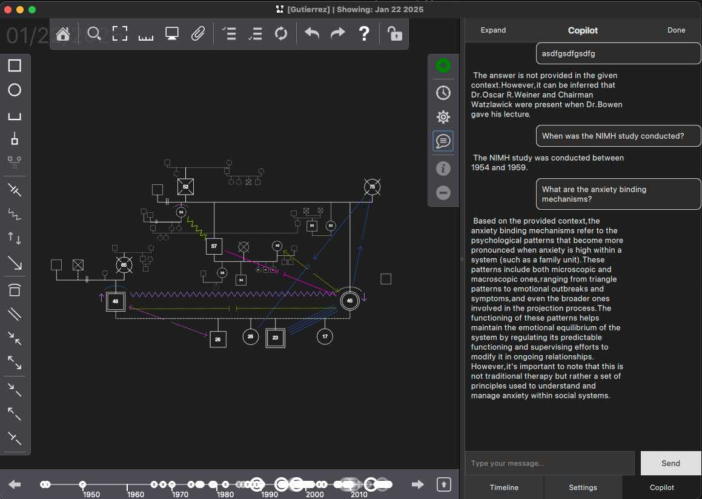

# BT Copilot

SARF (Symptom, Anxiety, Relationship, Functioning) is a novel clinical model, under test here, that treats the automatic, inherited reactions people have to each other, above all in families, as evolved biology. This repository is the research instrument: an AI coach that records a person's family as structured SARF data turn by turn, the expert coding and inter-rater reliability work that tests the model, and the F1 measurement of the machine's coding against expert ground truth.

The product built on it will live at [familydiagram.com](https://familydiagram.com).

Built by [Patrick Stinson](https://www.linkedin.com/in/patrickstinson/), who developed the clinical model.

### For engineers and recruiters

- [How the Coach Works](#how-the-coach-works)
  - [The Human Oracle and Its Tests](#the-human-oracle-and-its-tests)
- [Extraction Accuracy (F1)](#extraction-accuracy-f1)

### For clinicians and researchers

- [Novel Contributions to the Field](#novel-contributions-to-the-field)
  - [SARF Literature Review](doc/sarf-definitions/)
  - [SARF Data Model White Paper](https://docs.google.com/document/d/1k6ZvYEG1644L4SKqXzXoOvBnepmus2-8WwUfMh4R_4Y/edit?usp=sharing)
  - [Implicit Behavioral Model Synthesis](doc/archive/2026-09-plans/brainstorm-assessment/12_IMPLICIT_BEHAVIORAL_MODEL_SYNTHESIS.md)
  - [Family Diagram Visual Specification](doc/FAMILY_DIAGRAM_VISUAL_SPEC.md)
  - [Conversational Flow Evaluation](#phase-7-conversational-flow-evaluation-)
  - [Inter-Rater Reliability Study](#phase-11-inter-rater-reliability-study)
  - [Attachment and Big 5-Based Conversation Modeling & Measurement](#phase-12-attachment-and-big-5-based-conversation-modeling--measurement)
- [Extraction Accuracy (F1)](#extraction-accuracy-f1)
  - [F1 timeseries](https://patrickkidd.github.io/btcopilot/)
- [R&D roadmap: phases 1-13](#research-phases)
- [Clinical Research Compliance](#clinical-research-compliance)
- [SARF Literature Review](#sarf-literature-review)
- [Development Journal](#development-journal)

## How the Coach Works

One agent reads the conversation and decides each turn whether to ask, answer or change the record. The family record is its memory: the conversation is never rewritten, while the record changes as the person corrects it. The success measure is clinical, not a dataset: one or two correlations per person that change how they see their family. SARF took its first inspiration from Bowen family systems theory. The rules for when the timeline may be drawn and when the coach must ask are in [doc/DRAWABILITY.md](doc/DRAWABILITY.md).

The system is a Flask API with a Celery worker, Postgres, and a TypeScript page for phone and desktop. The diagram is a JSON document plus an append-only command log; one Python module mutates it, and the browser and the agent are clients of the same endpoint. `btcopilot.schema` is the one module other apps import, and it depends on nothing else in the package. Every model call is logged with its cost, and a refused turn falls back to an older model.

### The Human Oracle and Its Tests

Development answers to a human oracle: Patrick's rulings, each with an id (R-0001 and on), stored encrypted in `private/oracle/`. The open repo cites ruling ids and never restates them. No rubric or quality judgment is inferred without Patrick; he rules by example and by correcting proposed values.

Every test cites the ruling it checks, and a guard test enforces that. Every ruling has a citing test or a stated exception: owed where the behaviour is not built, waived where nothing observable could check it. Known defects are strict expected failures in [doc/KNOWN_DEFECTS.md](doc/KNOWN_DEFECTS.md). The strategy is in [doc/TEST_STRATEGY.md](doc/TEST_STRATEGY.md); the current state is in [doc/STATE.md](doc/STATE.md) and its derivation in [doc/HISTORY.md](doc/HISTORY.md).

## Novel Contributions to the Field

- [SARF Literature Review](doc/sarf-definitions/) - First exhaustive, 100% traceable literature review for Bowen Theory technical terms
- [SARF Data Model White Paper](https://docs.google.com/document/d/1k6ZvYEG1644L4SKqXzXoOvBnepmus2-8WwUfMh4R_4Y/edit?usp=sharing) - Novel clinical data model operationalizing Bowen theory constructs
- [Implicit Behavioral Model Synthesis](doc/archive/2026-09-plans/brainstorm-assessment/12_IMPLICIT_BEHAVIORAL_MODEL_SYNTHESIS.md) - Cross-validated theoretical framework synthesizing neuroscience, philosophy of mind, and clinical observation
- [Family Diagram Visual Specification](doc/FAMILY_DIAGRAM_VISUAL_SPEC.md) - Platform-independent specification for rendering Bowen family diagrams
- [Conversational Flow Evaluation](#phase-7-conversational-flow-evaluation-) - Objective metrics for measuring clinical interview quality
- [Inter-Rater Reliability Study](#phase-11-inter-rater-reliability-study) - First formal IRR study for family systems constructs at scale
- [Attachment and Big 5-Based Conversation Modeling & Measurement](#phase-12-attachment-and-big-5-based-conversation-modeling--measurement) - Synthetic client narratives structured by attachment style, with multi-dimensional clinical quality rubrics

## Extraction Accuracy (F1)

Best F1 per construct against expert-coded ground truth (six coded discussions). These were measured on the one-shot extraction of a whole conversation. The same measure continues on the new turn-by-turn coding once the inter-rater reliability group's ground truth exists.

| Construct | Best F1 | Configuration | Date |
|-----------|---------|---------------|------|
| People | 0.930 | Claude Fable 5 extraction, Gemini 3 Flash SARF review | 2026-06-09 |
| Pair-bonds | 0.832 | Gemini two-pass extraction | 2026-03-03 |
| Parent-child links | 0.815 | Gemini Flash plus parent inference from births | 2026-05-20 |
| Events | 0.617 | Claude Fable 5, extraction and SARF review | 2026-06-09 |
| SARF values (macro) | 0.621 | Claude Fable 5, extraction and SARF review (one run) | 2026-06-09 |
| Aggregate | 0.731 | Claude Fable 5, extraction and SARF review | 2026-06-09 |

Rows come from different model and matching versions, and the SARF-values row is a single run.

Per-statement extraction scored about 0.24 aggregate in late 2025, so whole-conversation extraction roughly tripled accuracy. Full tables: [F1 dashboard](doc/archive/2026-09-F1_DASHBOARD.md), [model evaluations](doc/archive/2026-09-MODEL_EVALUATIONS.md), [F1 timeseries](https://patrickkidd.github.io/btcopilot/).

## Research Phases

Each phase enabled the next. The goal was automated prompt optimization against expert ground truth, then the same evaluation applied to training human clinicians.

### Phase 1: RAG for Questions on the Clinical Literature ✓

ChromaDB vector store indexes the clinical literature. LLM queries return relevant academic passages that constrain responses to established theory—prevents the model from inventing clinical concepts.

- NLTK-based semantic chunking with sentence boundary detection
- Metadata tracking (author, title, source file) for citation
### Phase 2: SARF Data Model & Schema ✓

The extraction target: a clinical coding scheme with Pydantic-validated JSON output.

The model centers on people and events. People have parents; events carry the variable shifts. How the relationship variable breaks down is where the novelty in SARF lies.

| Variable | What it captures |
|----------|------------------|
| **Symptom** | Physical/mental health changes, goal impediments |
| **Anxiety** | Automatic responses to real or imagined threat |
| **Relationship** | Emotive actions between people (distance, conflict, overfunctioning, projection, triangles) |
| **Functioning** | Ability to balance emotion/intellect toward goals |

Events are timestamped incidents with associated variable shifts and involved persons. Enum-constrained relationship types ensure consistent classification.

### Phase 3: Delta-Based Extraction (PDP) ✓

Solves a core LLM extraction problem: if the model regenerates the full dataset each turn, hallucinations corrupt previously-correct data. Instead, the model outputs only deltas—additions, updates, deletions—validated and applied incrementally. The smaller, isolated changes prevent the larger data set from breaking.

- Provides event-driven architecture for clinical chart.
- Allows for both domain-expert coding of ground truth and real-time updates to chart while chatting with AI expert.
- User accept/reject actions generate labeled training data automatically
- Confidence scores (0.0-0.9) track extraction certainty


### Phase 4: Automated Audio Transcription ✓

The training app accepts audio recordings of real clinical interviews. AssemblyAI processes recordings with speaker diarization—automatically detecting and separating different speakers in the conversation.

- Upload audio files (MP3, WAV, M4A) directly to discussion page
- Speaker detection identifies clinician vs. client(s) automatically
- Auditors map detected speakers to people in the case file
- Multiple recordings contribute to a single case timeline
- HIPAA-compliant processing via BAA with AssemblyAI


### Phase 5: Formalized Minimum Data for Family Evaluation ✓

Comprehensive literature review produced a formalized definition of minimum necessary data for a family systems clinical evaluation. This is operationalized as a conversation protocol with explicit data collection checklist.

**Key insight**: A rules-based interview (fixed question sequence) cannot collect all necessary data. The clinician must actually converse because neither party knows which questions to ask until the story unfolds. The client's narrative contains the data—the clinician's job is to stay in the story while steering toward diagram-relevant facts.

Required data checklist includes:
- Presenting problem with timeline, involved parties, symptom onset
- Three-generation family structure (parents, siblings, grandparents, aunts/uncles)
- Nodal events (deaths, births, marriages, divorces, moves, illnesses)
- Connections between family events and symptom timing

Red flags for incomplete interviews: pivoting to family data before understanding presenting problem, collecting one side of family but not other, giving advice instead of gathering facts.

### Phase 6: Simulated AI Personas & Synthetic Data Generation ✓

LLM-generated user personas with behavioral traits (evasive, tangential, defensive, terse) simulate clinical conversations. Each persona has a detailed three-generation family history and presenting problem.

Five personas implemented with:
- Full family backgrounds (parents, siblings, grandparents, aunts/uncles, nodal events)
- Data point coverage tracking per category
- Trait-driven response variation (confused_dates, emotional, oversharing)

This enables systematic testing of extraction prompts without real clinical data.


### Phase 7: Conversational Flow Evaluation ✓

Automated quality scoring measures clinical interview effectiveness:

- **Robotic pattern detection**: therapist clichés ("It sounds like...", "How does that make you feel?"), repetitive sentence starters, verbatim echoing
- **Data coverage**: which required categories (Phase 5 checklist) did the AI successfully elicit?
- **Question density**: appropriate probing vs. interrogation

These metrics apply equally to AI prompts and human trainee clinicians—same rubric, objective comparison.

### Phase 8: Ground Truth Collection via Expert Auditing ✓

Web UI where domain expert clinicians review AI extractions from synthetic conversations (Phase 6). Corrections stored with provenance (who approved, when, original vs. edited). Approved feedback exports to test suites.

Addresses the core bottleneck in clinical ML: domain expertise is scarce, so the training workflow must maximize signal from each expert interaction.

### Phase 9: Hierarchical F1 Metrics ✓

Single-number accuracy metrics hide extraction failures. Multi-level evaluation:

1. **Entity detection F1**: Was a person/event/relationship detected at all?
2. **Value match F1**: For detected entities, were field values correct?
3. **Relationship F1**: For relationship events, were the involved parties correct?

Matching uses fuzzy name similarity (>0.8 threshold via rapidfuzz), date proximity (±7 days), and ID resolution across the positive/negative ID boundary. Depends on ground truth from Phase 8.


### Phase 10: Prompt Induction

With ground truth dataset (Phase 8) and F1 metrics (Phase 9), automate prompt optimization: iterate extraction prompts against test cases, measure accuracy deltas, converge toward optimal performance. The infrastructure exists; automation is the remaining step.

### Phase 11: Inter-Rater Reliability Study

Parallel expert coding (multiple auditors on same cases) to validate whether SARF model produces consistent results across practitioners. First formal IRR study for family systems constructs at scale.

### Phase 12: Attachment and Big 5-Based Conversation Modeling & Measurement

Synthetic client personas grounded in empirical personality and attachment research rather than surface behavioral labels. Three psychological frameworks drive persona construction:

1. **Attachment theory (AAI narrative structure)**: Each persona's attachment style (secure, anxious-preoccupied, dismissive-avoidant, fearful-avoidant) determines *how the narrative is structured* — coherent, fragmented, idealized, or contradictory — following Adult Attachment Interview coding dimensions.
2. **Big Five personality dimensions (OCEAN)**: Traits like neuroticism, agreeableness, extraversion, openness, and conscientiousness shape conversational behaviors — rumination patterns, emotional vocabulary range, narrative organization, rapport orientation. Used as internal design constraints to ensure trait combinations are psychologically coherent.
3. **Sex-differentiated and generational communication norms**: Help-seeking framing, emotional vocabulary, externalizing vs. internalizing presentation, somatic reporting, and rapport-talk vs. report-talk tendencies calibrated by sex and age cohort.

Dynamic persona generation: select parameters (attachment style, traits, sex, age) via web form, LLM generates a unique client with full three-generation family history. Each generated client persists as a named case for ground truth coding.

Multi-dimensional clinical quality measurement replaces single-score evaluation:
- **Therapist rubric**: robotic pattern detection, topic coverage, multigenerational exploration, emotional attunement, pacing — dimensions that map to clinical competencies for eventual human trainee assessment
- **Client rubric**: therapy-speak absence, information delivery naturalness, first-session behavior, emotional arc progression, narrative coherence by attachment style — constructs designed for eventual psychometric validation

Versioned rubrics allow longitudinal tracking as scoring criteria evolve. Same framework applies to both AI-generated and human conversations.

Spec: [doc/specs/SYNTHETIC_CLIENT_PROMPT_SPEC.md](doc/specs/SYNTHETIC_CLIENT_PROMPT_SPEC.md) | Research: [doc/specs/PSYCHOLOGICAL_FOUNDATIONS.md](doc/specs/PSYCHOLOGICAL_FOUNDATIONS.md)

### Phase 13: The Coach

The research then asked whether an interactive loop removes the extraction problem. It holds for family structure and fails for the timeline: people, pair-bonds and parents can be built turn by turn and caught by a person looking at the drawing, while dated shifts and SARF values were better extracted in one batch. Prompt tuning on batch extraction had reached zero marginal return.

The result is the coach: it edits the record turn by turn, and a person's correction on the picture is the check. Development answers to the human oracle instead of a fixed ground-truth set. The inter-rater reliability study became a three-stage ground-truth process: blind coding, a blind vote, then a ratifying meeting.

### Future: Human Clinician Training

Apply the same evaluation (Phase 7 conversation metrics, Phase 9 extraction accuracy) to human clinician training. Students practice with synthetic clients and receive objective scores on interview quality and data completeness, compared directly to the AI.

## Clinical Research Compliance

This project involves clinical research with confidential patient data. All data processing is HIPAA-compliant:

- **Business Associate Agreements (BAA)** with the model and transcription vendors for encrypted patient data processing
- **Informed consent** required for all research participants: [Informed Consent Template](doc/archive/2026-09-Informed%20Consent%20Recording%20Sessions%20for%20Research%20TEMPLATE.docx)

Professionals interested in participating in the research should contact the project maintainer.

## SARF Literature Review

**[doc/sarf-definitions/](doc/sarf-definitions/)** - The first exhaustive, 100% traceable literature review for Bowen Theory technical terms.

Every passage in Bowen's *Family Therapy in Clinical Practice*, Kerr's *Family Evaluation*, and Havstad's seminal SARF paper that could pertain to SARF model terms has been indexed, coded, and listed. 12 terms defined with ~400+ indexed passages across ~3,500+ lines of contextual reading.

| Term | Category |
|------|----------|
| Functioning, Anxiety, Symptom | Core Variables |
| Conflict, Distance, Cutoff, Overfunctioning, Underfunctioning, Projection | Relationship Mechanisms |
| Inside, Outside | Triangle Positions |
| DefinedSelf | Mature Moves |

Each definition includes operational definitions, observable markers for AI classification, key discriminators, and traceable citations. No external sources or AI training data—exclusively derived from authorized texts.

Methodology: [doc/sarf-definitions/METHODOLOGY.md](doc/sarf-definitions/METHODOLOGY.md)

# Development Journal

## 2026-08-28 - Family structure can be built live, the timeline cannot

Building the family record turn by turn works for people, pair-bonds and parents, because the person looking at the drawing catches the errors. Dated shifts and SARF values still came out better when coded from the whole conversation at once. That split is what the coach is built on now.

## 2026-06-09 - Stronger models close the gap on events and SARF

A frontier model raised Events F1 from 0.43 to 0.62 and SARF values from 0.38 to 0.62 over production, at a much higher cost per conversation. People and pair-bonds were already near their ceiling.

## 2026-05-20 - Parents can be inferred from births

Inferring parent-child links from birth events took that F1 from 0.37 to 0.82, and 90% of each family now connects into one diagram instead of 51%.
## 2026-03-03 - 2-pass split extraction

*Break hard problems into smaller ones.* Single-prompt extraction plateaued because legacy training examples buried in the prompt were overriding new instructions. Split extraction into two focused passes — first people and family structure, then clinical variable shifts — each with a clean, purpose-built prompt. Aggregate accuracy up 12%, relationship extraction up 54%. Task decomposition beat prompt engineering. **Aggregate F1 crossed the 0.5 MVP milestone (0.669), with Events also clearing 0.5 for the first time.**

## 2026-02-24 - Single-prompt extraction

*Let the conversation finish before analyzing it.* Instead of the AI extracting data from every single message (25+ LLM calls per conversation, massive duplication), the Personal app now waits until the user taps "Build my diagram" and sends the whole conversation in one shot. Accuracy nearly doubled (F1 0.25 → 0.45) with no prompt changes. Event detection crossed the viability threshold (F1 0.09 → 0.29), resolving whether events could ship in MVP.

## 2026-02-14 - Cumulative extraction pivot

*You can't improve what you can't measure.* Grading the AI's work one message at a time introduced so much noise that accuracy scores were stuck at ~0.22 regardless of what we changed. The AI and the human expert often noticed the same fact at different points in the conversation, which the scoring system counted as two errors instead of zero. Switched to grading the *complete result* after an entire conversation — the thing the user actually sees. Accuracy signal became meaningful immediately, GT coding time halved, and we discovered the AI was extracting zero relationship data (prompt had no examples).

## 2025-12-14 - Modeling therapeutic conversation

*I am modeling therapeutic conversation*. I don't know if this has ever been done before. Measuring therapist performance at collecting enough data for clinical evaluation. Requires measuring coach performance statement by statement.

- *The first comprehensive index of technical terms for Bowen theory* using Bowen and Kerr's books. *Every single* passage that might be related to a given term in the SARF model (Anxiety, Symptom, Functioning, conflict, projection, triangles, etc). It isn't the eight concepts but I could easily re-run this on those (and probabyl will) [btcopilot/doc/sarf-definitions/METHODOLOGY.md](doc/sarf-definitions/METHODOLOGY.md). In a nuthsell, this is many passes through the literature back and forth with human and AI. It required a combination of:
  - Exhaustive knowledge of the source literature (from Stinson, 2020)
  - Doctoral-level qualitative research methods
  - AI Context Architect Expertise
  - Software Architect Expertise
  Progress tracked here: [btcopilot/doc/sarf-definitions/PROGRESS.md](doc/sarf-definitions/PROGRESS.md)
- Switched to gemini flash API for cheaper and probably better data extraction. Seeking HIPAA BAA with Google.
- Improved Synthetic AI client personalities with:
  - larger hard-coded histories
  - "levels of depth" to force AI coach to probe deeper or fail to get necessary information.
  - Improvisation of case content beyond the provided history, so long as it is not contradictory
  - They started sponateously pushing back when the conversation went on too long, about 60 minutes, wow.
- Improved AI coach conversational flow with:
  - Allow feeling content around the problem for ~8 statements before pivoting to filling out data model. Helps the person get some of the presenting problem out, get some emotional buy-in.

*Dev notes*
- Added mcp server for claude code to manage the web server proces.

## 2025-12-08 - Prompt induction framework

- Added prompt induction framework:
  [btcopilot/doc/PROMPT_OPTIMIZATION.md](doc/archive/2026-09-PROMPT_OPTIMIZATION.md)
  Using Claude Code's command line API to run it from a script. Get baseline F1,
  tweak system prompts, run AI extraction, compare baseline. Run 10 iterations
  or until F1 improvement plateaus. Super cool!

## 2025-06-28 - Working data extraction from chat discussion. Using Havstad's SARF data model. Basically trying to build a clinical coach bot.
- Started trying to extract data from each individual text message. Discovered data points exist across messages.
- Clarifyed data model:
  - People: siblings + offspring
  - Events: variable shifts; Symptom, Anxiety, Relationship, Functioning
    - Relationship sub-divides into Mechanism & Triangle (negative), Defined self (positive)
    - Triangle; insides + outside
    - Mechanism: movers + recipients
  - Have to figure out what to do with special events w/o apparent variable shifts, e.g. birth, death, marriage, divorce
- Moved to managing a rolling pool of data points from chat conversation. Much more sophisticated and complicated.
  - Moved to pending data pool (PDP) model where user confirms inferred / extracted data points.
  - llm only provides deltas for pending pool to avoid data loss from hallucinations when re-writing the entire pending pool every call.
  - Division between persistent database and PDP. Deltas are the core atomic component to validate.
- Plan to build personal mobile app with web-based auditing system to scale model training with human feedback.
  - Potential to generate database for family research, complete with data model.

## 2025-03-09 - Using Mistral's PDF OCR doc to read pdfs more accurately, and `spacy`'s semantic splitting to passages to start and end with sentances that make a single point.

## 2025-02-19 - Added support for timeline events, released in [Family Diagram v2 Beta](https://alaskafamilysystems.com/family-diagram/family-diagram-phase-2-beta/)!

- You can now include timeseries events in the query! You can ask the model to
  analyze the timeseries data and draw conclusions from the literature.
- Added Kerr's Family Evaluation (1988) to sources.

## 2025-02-15 - Automatically testing model's accuracy

I defined a set of quiz questions with expected correct answers. The quiz will be improved as time goes on.

Example Passing answer:

```
**** QUESTION:What are the two positions in a triangle called?

**** EXPECTED ANSWER:Inside and outside

**** RECEIVED ANSWER: Answer:  In the given context, the two positions in a triangle are not explicitly named. However, they can be inferred as the close twosome and the outsider. The close twosome is the pair that forms the base of the triangle, while the outsider is the third person who is not part of the close relationship but interacts with both members of the twosome.
Sources: ['21 - On the Differentiation of Self.pdf', '16 - Theory in the Practice of Psychotherapy.pdf', '21 - On the Differentiation of Self.pdf', '21 - On the Differentiation of Self.pdf', '10 - Family Therapy and Family Group Therapy.pdf']
Vector DB Time: 1.8134565340005793
LLM Time: 36.359419119005906
Total Time: 38.17371924100007

INFO     test_model:test_model.py:56 Copilot vector db time: 1.8134565340005793
INFO     test_model:test_model.py:57 Copilot llm time: 36.359419119005906
INFO     test_model:test_model.py:58 Copilot total time: 38.17371924100007
```

## 2025-02-15 - First Copilot UI!

The answers are slow, but they work! Still need to show expandable list of sources with passages.
  
  - LLM: `mistral`
  - Embeddings: `sentence-transformers/all-MiniLM-L6-v2`

## 2025-02-13 - Pre-processed Bowen's book into chapter pdfs

Watching many youtube videos on RAG including better pdf
  processing, different llm's, etc. Found better pdf copy of Bowens book w/o
  page numbers, Pre-processed Bowen's book into chapters without titles.
  epigraphs. Include book name and chapter title from file names in langchain
  doc metadata. Per-chapter pdf ingestion took ~54 seconds.
  - Returned in ~54 seconds for "What are the four anxiety binding mechanisms?"
```
Response:  The provided context does not explicitly mention the term "anxiety binding mechanisms" or list any specific four mechanisms. However, it suggests several patterns and dynamics that help maintain emotional equilibrium in a family system, which can be perceived as "anxiety binding." These include:

1. Triangle patterns - interpersonal relationships involving three people where one person's actions affect the other two, creating a cycle of tension and reaction.
2. Projection process - the tendency for individuals to transfer their own unacceptable impulses, feelings or traits onto others, allowing them to avoid acknowledging these aspects within themselves.
3. Patterns of transfer anxiety - ways in which anxiety is passed between individuals, with variations such as a mother forcing anxiety or psychosis onto a resisting patient.
4. The level of integration and differentiation of self - refers to the organism's ability to adapt and cope with anxiety, emphasizing the importance of maintaining emotional equilibrium within oneself.

These patterns and dynamics help bind anxiety in a family system by addressing and managing stress and tension within relationships, promoting emotional stability.

Sources: ['22 - Toward the Differentiation of Self in Ones Family of Origin.pdf', '18 - Society Crisis and Systems Theory.pdf', '18 - Society Crisis and Systems Theory.pdf', '16 - Theory in the Practice of Psychotherapy.pdf', '1 - Treatment of Family Groups with a Schizophrenic Member.pdf']
```
  - Returned in ~54 seconds for: "What is differentiation of self?"
  ```
  Response:  Differentiation of self, as described in the given context, refers to a concept that deals with an individual working on their own self, controlling their emotions, becoming more responsible, and permitting others to be themselves. It's analogous to the process of differentiation in biology, where cells separate from each other for specialized functions. In this theoretical system, higher levels of differentiation equate to emotional maturity. The level of differentiation may depend on factors like the level of differentiation of one's parents and the nature of the relationship between the child and their parents.

Sources: ['9 - The Use of Family Theory in Clinical Practice.pdf', '12 - Alcoholism and the Family.pdf', '17 - An Interview with Murray Bowen.pdf', '16 - Theory in the Practice of Psychotherapy.pdf', '16 - Theory in the Practice of Psychotherapy.pdf']
  ```

## 2025-02-11 - Langchain and RAG

Colleague suggested langchain with RAG. Used RAG with cloud-based `groq` llm
  and chroma vector db produced better answers but sometimes couldn't find any
  relevant data.

## 2025-02-10 - Fine-tuned GPT2 model

Trained gpt2 model on Bowen's book, with garbage from titles, page numbers,
  etc. Took four hours on i9 macbook pro and responses had mediocre sentance
  structure with too much focus on a few passages.
```
  It is essentially impossible to know the percentage who get married and who do not get divorced. At thi
s level of differentiation, differentiation does not begin to take place until there is a certain percentage of people who are sufficien tly involved with their families of origin to begin differentiation without emotional participation in the family emotional system.
do well on tests of differentiation have a reasonable chance of getting a social or professional degree,
if they keep the effort on their families of origin. Results are less with this approach if the family effort is with a spouse in the 30 to 40 range.
People in the 50 to 75 range get married within a few generations. There are those who get married within a few generations and continue for life and who terminate marriage within the next five to ten years. Those with very low levels of differentiation have an infinite n umber of satisfying marriages with intact families and those with a high level of fusion who terminate marriage within several generatio
A typical marriage is one in which the basic level of differentiation is transmitted in marriage, but it is not manifested in children.
There are marriages in which the basic level is transmitted in children who use various combinations of marriage mechanisms and 385 other outside relationships to raise the basic level of differentiation. There are marriages in which the basic level is transmitted in marriage and where it continues in subsequent marriages, but the transmission is less intense and symptoms are less intense.
Marriages in which the basic level is transmitted in marriage are called stable marriages and in which there are no symptoms,
the sympto
ms are more episodic and it is not as serious and long-term as with less severe emotional illness and less severe emotional illness and less long-term transmission of the problem to a spouse with good levels of differentiation. There are marriages in which the basic level is transmitted in marriage where the basic level is sufficiently submerged in the marriage to be seen only with one or two children to
be meaningful symptoms but symptoms are less intense and transmission is less serious and
is much less intense than with severe illness
and less long-term transmission of the problem to one or two children.
People in the 65 to 70 range get married within a few generations. There are others who do well with a few children and maintain self in the 30 to 40 range until the problems subside and thereafter it is seen as the "fusion" phenomenon with a child who gets "programmed" t o the family projection process with the parents. The children grow up
  ```
