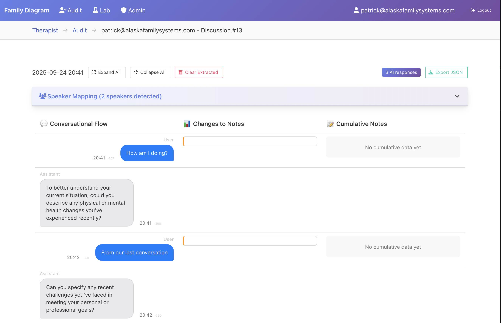

# BT Copilot

Infrastructure for training LLMs to extract structured clinical data from natural conversation. Implements the SARF novel clinical data model (Symptom, Anxiety, Relationship, Functioning) for family systems clinical assessment. Powers the [Family Diagram](https://familydiagram.com) app.

[SARF Data Model White Paper](https://docs.google.com/document/d/1k6ZvYEG1644L4SKqXzXoOvBnepmus2-8WwUfMh4R_4Y/edit?usp=sharing)

**📋 [Decision Log](decisions/log.md)** | **📚 [Domain Context](CONTEXT.md)** | **📖 [Dev Journal](#development-journal)**


---

## Table of Contents

- [Discovery and Development Roadmap](#discovery-and-development-roadmap)
  - [Phase 1: RAG System](#phase-1-rag-system-for-questions-on-the-clinical-literature-)
  - [Phase 2: SARF Data Model & Schema](#phase-2-sarf-data-model--schema-)
  - [Phase 3: Delta-Based Extraction (PDP)](#phase-3-delta-based-extraction-pdp-)
  - [Phase 4: Automated Audio Transcription](#phase-4-automated-audio-transcription-)
  - [Phase 5: Formalized Minimum Data](#phase-5-formalized-minimum-data-for-family-evaluation-)
  - [Phase 6: Synthetic Personas](#phase-6-simulated-ai-personas--synthetic-data-generation-)
  - [Phase 7: Conversational Flow Evaluation](#phase-7-conversational-flow-evaluation-)
  - [Phase 8: Ground Truth Collection](#phase-8-ground-truth-collection-via-expert-auditing-)
  - [Phase 9: Hierarchical F1 Metrics](#phase-9-hierarchical-f1-metrics-)
  - [Phase 10: Prompt Induction](#phase-10-prompt-induction)
  - [Phase 11: Inter-Rater Reliability Study](#phase-11-inter-rater-reliability-study)
  - [Phase 13: ???]
- [Future: Human Clinician Training](#phase-N-human-clinician-training-application)
- [Clinical Research Compliance](#clinical-research-compliance)
- [Components](#components)
  - [Training System (Web app)](#bt-copilot-training-system-web-app)
  - [Personal/Mobile App Server](#personalmobile-app-server)
  - [Pro/Desktop App Server](#prodesktop-app-family-diagram-server)
- [Architecture](#architecture)
- [Practical Overview](#practical-overview)
- [Literary Sources](#literary-sources)
- [Development Journal](#development-journal)

---

## R&D Roadmap

This describes the major issues confronted and methods used to overcome them.
These are big issues. There is a lot of learning going on. I am only able to see
the next issue before digging into it and learning what comes after that.

Each phase enables the next. The end goal is automated prompt optimization against ground truth—then applying those evaluation methods to human clinician training.

### Phase 1: RAG for Questions on the Clinical Literature ✓
*Production*

ChromaDB vector store indexes the clinical literature. LLM queries return relevant academic passages that constrain responses to established theory—prevents the model from inventing clinical concepts.

- Clinical inferences: Can ask questions about the current case in the [Pro App](https://github.com/patrickkidd/familydiagram)
- NLTK-based semantic chunking with sentence boundary detection
- Metadata tracking (author, title, source file) for citation

Source: [btcopilot/pro/copilot/](btcopilot/pro/copilot/)

### Phase 2: SARF Data Model & Schema ✓
*Production*

The extraction target: a clinical coding scheme with Pydantic-validated JSON output.

This one took a lot of thinking for a clean, normalized data model. It centers
around People and Events. People simply have parents, Events have a number of
fields. How the `Events.relationship` field breaks down is where all the novelty
in SARF is.

| Variable | What it captures |
|----------|------------------|
| **Symptom** | Physical/mental health changes, goal impediments |
| **Anxiety** | Automatic responses to real or imagined threat |
| **Relationship** | Emotive actions between people (distance, conflict, overfunctioning, projection, triangles) |
| **Functioning** | Ability to balance emotion/intellect toward goals |

Events are timestamped incidents with associated variable shifts and involved persons. Enum-constrained relationship types ensure consistent classification.

Source: [btcopilot/schema.py](btcopilot/schema.py)

### Phase 3: Delta-Based Extraction (PDP) ✓
*Production*

Solves a core LLM extraction problem: if the model regenerates the full dataset each turn, hallucinations corrupt previously-correct data. Instead, the model outputs only deltas—additions, updates, deletions—validated and applied incrementally. The smaller, isolated changes prevent the larger data set from breaking.

- Provides event-driven architecture for clinical chart.
- Allows for both domain-expert coding of ground truth and real-time updates to chart while chatting with AI expert.
- User accept/reject actions generate labeled training data automatically
- Confidence scores (0.0-0.9) track extraction certainty

Source: [btcopilot/pdp.py](btcopilot/pdp.py), [btcopilot/personal/prompts.py](btcopilot/personal/prompts.py)


### Phase 4: Automated Audio Transcription ✓
*Production*

The training app accepts audio recordings of real clinical interviews. AssemblyAI processes recordings with speaker diarization—automatically detecting and separating different speakers in the conversation.

- Upload audio files (MP3, WAV, M4A) directly to discussion page
- Speaker detection identifies clinician vs. client(s) automatically
- Auditors map detected speakers to people in the case file
- Multiple recordings contribute to a single case timeline
- HIPAA-compliant processing via BAA with AssemblyAI

Once transcribed, each statement runs through AI-based SARF extraction, generating deltas for expert review.

Source: [btcopilot/training/routes/discussions.py](btcopilot/training/routes/discussions.py)

### Phase 5: Formalized Minimum Data for Family Evaluation ✓
*Production*

Comprehensive literature review produced a formalized definition of minimum necessary data for a family systems clinical evaluation. This is operationalized as a conversation protocol with explicit data collection checklist.

**Key insight**: A rules-based interview (fixed question sequence) cannot collect all necessary data. The clinician must actually converse because neither party knows which questions to ask until the story unfolds. The client's narrative contains the data—the clinician's job is to stay in the story while steering toward diagram-relevant facts.

Required data checklist includes:
- Presenting problem with timeline, involved parties, symptom onset
- Three-generation family structure (parents, siblings, grandparents, aunts/uncles)
- Nodal events (deaths, births, marriages, divorces, moves, illnesses)
- Connections between family events and symptom timing

Red flags for incomplete interviews: pivoting to family data before understanding presenting problem, collecting one side of family but not other, giving advice instead of gathering facts.

Source: [btcopilot/personal/prompts.py](btcopilot/personal/prompts.py)

### Phase 6: Simulated AI Personas & Synthetic Data Generation ✓
*Complete*

LLM-generated user personas with behavioral traits (evasive, tangential, defensive, terse) simulate clinical conversations. Each persona has a detailed three-generation family history and presenting problem.

Five personas implemented with:
- Full family backgrounds (parents, siblings, grandparents, aunts/uncles, nodal events)
- Data point coverage tracking per category
- Trait-driven response variation (confused_dates, emotional, oversharing)

This enables systematic testing of extraction prompts without real clinical data.

Source: [btcopilot/tests/personal/synthetic.py](btcopilot/tests/personal/synthetic.py)


     

### Phase 7: Conversational Flow Evaluation ✓
*Complete*

Automated quality scoring measures clinical interview effectiveness:

- **Robotic pattern detection**: therapist clichés ("It sounds like...", "How does that make you feel?"), repetitive sentence starters, verbatim echoing
- **Data coverage**: which required categories (Phase 5 checklist) did the AI successfully elicit?
- **Question density**: appropriate probing vs. interrogation

These metrics apply equally to AI prompts and human trainee clinicians—same rubric, objective comparison.

Source: QualityEvaluator in [btcopilot/tests/personal/synthetic.py](btcopilot/tests/personal/synthetic.py)

### Phase 8: Ground Truth Collection via Expert Auditing ✓
*In Progress*

Web UI where domain expert clinicians review AI extractions from synthetic conversations (Phase 6). Corrections stored with provenance (who approved, when, original vs. edited). Approved feedback exports to test suites.

Addresses the core bottleneck in clinical ML: domain expertise is scarce, so the training workflow must maximize signal from each expert interaction.

Source: [btcopilot/training/](btcopilot/training/)

### Phase 9: Hierarchical F1 Metrics ✓
*Complete*

Single-number accuracy metrics hide extraction failures. Multi-level evaluation:

1. **Entity detection F1**: Was a person/event/relationship detected at all?
2. **Value match F1**: For detected entities, were field values correct?
3. **Relationship F1**: For relationship events, were the involved parties correct?

Matching uses fuzzy name similarity (>0.8 threshold via rapidfuzz), date proximity (±7 days), and ID resolution across the positive/negative ID boundary. Depends on ground truth from Phase 8.

Source: [btcopilot/training/f1_metrics.py](btcopilot/training/f1_metrics.py)


### Phase 10: Prompt Induction
*Planned*

With ground truth dataset (Phase 8) and F1 metrics (Phase 9), automate prompt optimization: iterate extraction prompts against test cases, measure accuracy deltas, converge toward optimal performance. The infrastructure exists; automation is the remaining step.

### Phase 11: Inter-Rater Reliability Study
*Planned*

Parallel expert coding (multiple auditors on same cases) to validate whether SARF model produces consistent results across practitioners. First formal IRR study for family systems constructs at scale.

### Phase 12: ???

## Future: Human Clinician Training Application
*Future*

Apply the same evaluation framework (Phase 7 conversational flow metrics, Phase 9 extraction accuracy) to human clinician training. Students practice with synthetic personas, receive objective scores on interview quality and data collection completeness. Direct comparison to AI baseline.

---

## Clinical Research Compliance

This project involves clinical research with confidential patient data. All data processing is HIPAA-compliant:

- **Business Associate Agreements (BAA)** in place with OpenAI and AssemblyAI for encrypted patient data processing
- **Informed consent** required for all research participants: [Informed Consent Template](doc/Informed%20Consent%20Recording%20Sessions%20for%20Research%20TEMPLATE.docx)

Professionals interested in participating in the research should contact the project maintainer.

## Components

btcopilot consists of the machine learning / training system, the personal / mobile app, and the pro app.

### BT Copilot Training System (Web app)

The SARF model scans a text conversation between any number of people and
compiles a database of people, and events containing shifts in four variables -
SARF. SARF are  Symptom, Anxiety, Relationship, Functioning. These four
variables represent the basic clinical hypothesis of Bowen theory.

The web auditing system is for domain-experts to read through case examples and
audit/correct the AI-extracted data. Those corrections will be used for a few
different outcomes:
- To train/fine-tune an AI model to do the extraction very well.
  - If model alignment is achieved (if the model ends up working), it will be
    integrated into the [Family Diagram app](https://familydiagram.com) to
    automatically fill out a diagram for the user.
- To conduct a formal, scalable inter-rater reliability study for the SARF data
  model. Such a study would be the first formal study at scale for Bowen theory
  in general.
  - If IRR is achieved for the SARF data model then the auditing system can be
    expanded to serve as a standardized "Bowen test" for certification.

Each auditor gets their own dashboard:


Audio transcripts are automatically converted to text threads with speakers
detected. Auditors can map detected speakers to people in the case file so that
multiple transcripts and chat threads contribute to the case file.



The core of the auditing system is the SARF editor. Every statement from the clinical subject(s) runs the AI extraction model, which spits out any deltas to the current database that it detects. Sometimes these are accurate, sometimes they are not. In any case, the auditor can input their own corrected version. These corrections are:
- retained to improve the model
- added to a growing test suite to ensure that an improvement in one area does
  not break another area.

This body of corrections becomes "ground truth" for coding the SARF model in Bowen theory, which is an essential task for any clinical evaluation.


Source Code: [btcopilot/training](btcopilot/training)

### Personal/Mobile App Server

The personal mobile app contains the core logic and data extraction for the SARF
training system. This app is currently in development here:
[github.com/patrickkidd/familydiagram](github.com/patrickkidd/familydiagram)

Source Code: [btcopilot/personal](btcopilot/personal)

### Pro/Desktop App (Family Diagram) Server

In a nuthsell, BT Copilot evaluates a family diagram based on the academic
literature. It is currenly launched inthe [Family Diagram](https://familydiagram.com) app, which will become the "Pro" version while the personal/mobile version is coming soon.

BT suggests that emotional problems in an individual are tightly linked to
interpersonal transactions, driven by chronic anxiety, between people in that
person's nuclear family. BT describes how this process occurs over time and how
to document it.

Unfortunately, BT has no formal scientific models that can be applied to a
software tool. Bowen theory's models are only conceptual and scattered
throughout the academic literature. Application still relies on a person trained
in the theory, which makes application an art instead and not a science.

Luckily, the BT literature is surprisingly consistent across many authors. The
AI revolution is driven by one key innovatyion - computers both understanding
and writing human language. BT Copilot uses AI to build a model from the
literature so that it can analyze the family's role in an individual's symptom.

Source Code: [btcopilot/pro](btcopilot/pro)

## Architecture

__Data model + flow__

Overview: [doc/DATA_MODEL_FLOW.md](doc/DATA_MODEL_FLOW.md)

```
familydiagram (Pro App)
    ↓
    └─→ Server: POST/PATCH /diagrams/{id}
        └─→ btcopilot.pro.routes.diagrams()
            └─→ Diagram.set_diagram_data(diagram_data)
                └─→ pickle.dumps() → LargeBinary column

User Chat Flow (Personal App):
    ↓
    └─→ Personal API: POST /personal/discussions/{id}/ask
        └─→ btcopilot.personal.chat.ask()
            ├─→ Load: diagram.get_diagram_data()
            ├─→ Extract: pdp.update() → LLM returns PDPDeltas
            ├─→ Apply: pdp.apply_deltas() → new_pdp
            ├─→ Store: diagram.set_diagram_data(updated)
            └─→ Save: statement.pdp_deltas = asdict(PDPDeltas)

PDP Workflow (Personal App):
    ↓
    User sees PDP items in UI
    ├─→ Accept: POST /diagrams/{id}/pdp/{pdp_id}/accept
    │   └─→ Move from PDP to main database (negative → positive ID)
    │
    └─→ Reject: POST /diagrams/{id}/pdp/{pdp_id}/reject
        └─→ Remove from PDP
```

## Practical Overview

Copilot knows "Bowen theory" from the literature. Therefore, it uses a
conceptual model as opposed to a formal statistical model.

When you ask it a question, the following happens:

- Finds passages from the literature that match the question
- Answers the question based only on those passages and not any infomation from
  the internet.


When you as it a question *with timeline data included*, the following happens:

- Assumes the question is about the timeline, prompting with the following:
```
The following is 1) timeseries data from a family's emotional functioning, 2) a
question about the timeseries, and C) literature containing the concepts used to
evaluate the timeseries. Answer the question about the timeseries using only the
provided academic literature.
```
- Finds passages from the literature that match the question.
- Answers the question about the timeline, based only on those passages and not any infomation from
  the internet.

## Literary Sources

- Seminal literature Bowen theory
    - Terms: Differentiation of self, triangles, etc
- Collective Behavior and Intelligence
    - Center for Collective Behavior, Max Planck Institute of Animal Behavior (https://www.ab.mpg.de/couzin)
- More to come: Sapolski, All the psychologists, etc.

## Academic Projects / Questions

The following are non-technical theoretical challenges for Bowen theory:

- Define Bowen theory quiz
  - Consists of a series of questions and answers stored here: [btcopilot/tests/data/quizzes.py]
  - Used to automatically test the accuracy of model repsponse
  - Should attach the theory from many different angles
- ** Define necessary timeseries for shift
- Define chat prompts for timeline data
  - Biggest impact to how the data is evaluated

## Wiki

https://github.com/patrickkidd/btcopilot/wiki/Frankenstein-Phase-%E2%80%90-R&D

## Token Limits for Popular Models

- GPT-4 (8k and 32k token models):
  - Default GPT-4 has a context window of 8,192 tokens.
  - GPT-4-32k offers a larger 32,768 token window, but it's more expensive and slower.
- Mistral and similar open-source LLMs:
  - Typically have 4k–8k token limits (depending on the specific model and configuration).
- Tokens include all text: your prompt + the model's response. So, a 4k-token model leaves room for ~3k tokens for input and ~1k for output.

Practical Numbers:
- A single token is roughly 4 characters in English.
- For GPT-4 (8k): ~6,000 words total for the entire conversation (timeline + literature + user query + LLM response).

Here’s a rough idea of token usage:
- Timeline (10 years, summarized)	~500 tokens
- Academic context (5 chunks)	~2,000 tokens
- Prompt structure and query	~500 tokens
- Total	~3,000 tokens
This fits comfortably within an 8k-token model. For larger datasets, you'd need summarization, chunking, or a larger context model.

# Development Journal

## 2025-02-10 - Fine-tuned GPT2 model

Trained gpt2 model on Bowen's book, with garbage from titles, page numbers,
  etc. Took four hours on i9 macbook pro and responses had mediocre sentance
  structure with too much focus on a few passages.
```
  It is essentially impossible to know the percentage who get married and who do not get divorced. At thi
s level of differentiation, differentiation does not begin to take place until there is a certain percentage of people who are sufficien tly involved with their families of origin to begin differentiation without emotional participation in the family emotional system.
do well on tests of differentiation have a reasonable chance of getting a social or professional degree,
if they keep the effort on their families of origin. Results are less with this approach if the family effort is with a spouse in the 30 to 40 range.
People in the 50 to 75 range get married within a few generations. There are those who get married within a few generations and continue for life and who terminate marriage within the next five to ten years. Those with very low levels of differentiation have an infinite n umber of satisfying marriages with intact families and those with a high level of fusion who terminate marriage within several generatio
A typical marriage is one in which the basic level of differentiation is transmitted in marriage, but it is not manifested in children.
There are marriages in which the basic level is transmitted in children who use various combinations of marriage mechanisms and 385 other outside relationships to raise the basic level of differentiation. There are marriages in which the basic level is transmitted in marriage and where it continues in subsequent marriages, but the transmission is less intense and symptoms are less intense.
Marriages in which the basic level is transmitted in marriage are called stable marriages and in which there are no symptoms,
the sympto
ms are more episodic and it is not as serious and long-term as with less severe emotional illness and less severe emotional illness and less long-term transmission of the problem to a spouse with good levels of differentiation. There are marriages in which the basic level is transmitted in marriage where the basic level is sufficiently submerged in the marriage to be seen only with one or two children to
be meaningful symptoms but symptoms are less intense and transmission is less serious and
is much less intense than with severe illness
and less long-term transmission of the problem to one or two children.
People in the 65 to 70 range get married within a few generations. There are others who do well with a few children and maintain self in the 30 to 40 range until the problems subside and thereafter it is seen as the "fusion" phenomenon with a child who gets "programmed" t o the family projection process with the parents. The children grow up
  ```

## 2025-02-11 - Langchain and RAG

Colleague suggested langchain with RAG. Used RAG with cloud-based `groq` llm
  and chroma vector db produced better answers but sometimes couldn't find any
  relevant data.

## 2025-02-13 - Pre-processed Bowen's book into chapter pdfs

Watching many youtube videos on RAG including better pdf
  processing, different llm's, etc. Found better pdf copy of Bowens book w/o
  page numbers, Pre-processed Bowen's book into chapters without titles.
  epigraphs. Include book name and chapter title from file names in langchain
  doc metadata. Per-chapter pdf ingestion took ~54 seconds.
  - Returned in ~54 seconds for "What are the four anxiety binding mechanisms?"
```
Response:  The provided context does not explicitly mention the term "anxiety binding mechanisms" or list any specific four mechanisms. However, it suggests several patterns and dynamics that help maintain emotional equilibrium in a family system, which can be perceived as "anxiety binding." These include:

1. Triangle patterns - interpersonal relationships involving three people where one person's actions affect the other two, creating a cycle of tension and reaction.
2. Projection process - the tendency for individuals to transfer their own unacceptable impulses, feelings or traits onto others, allowing them to avoid acknowledging these aspects within themselves.
3. Patterns of transfer anxiety - ways in which anxiety is passed between individuals, with variations such as a mother forcing anxiety or psychosis onto a resisting patient.
4. The level of integration and differentiation of self - refers to the organism's ability to adapt and cope with anxiety, emphasizing the importance of maintaining emotional equilibrium within oneself.

These patterns and dynamics help bind anxiety in a family system by addressing and managing stress and tension within relationships, promoting emotional stability.

Sources: ['22 - Toward the Differentiation of Self in Ones Family of Origin.pdf', '18 - Society Crisis and Systems Theory.pdf', '18 - Society Crisis and Systems Theory.pdf', '16 - Theory in the Practice of Psychotherapy.pdf', '1 - Treatment of Family Groups with a Schizophrenic Member.pdf']
```
  - Returned in ~54 seconds for: "What is differentiation of self?"
  ```
  Response:  Differentiation of self, as described in the given context, refers to a concept that deals with an individual working on their own self, controlling their emotions, becoming more responsible, and permitting others to be themselves. It's analogous to the process of differentiation in biology, where cells separate from each other for specialized functions. In this theoretical system, higher levels of differentiation equate to emotional maturity. The level of differentiation may depend on factors like the level of differentiation of one's parents and the nature of the relationship between the child and their parents.

Sources: ['9 - The Use of Family Theory in Clinical Practice.pdf', '12 - Alcoholism and the Family.pdf', '17 - An Interview with Murray Bowen.pdf', '16 - Theory in the Practice of Psychotherapy.pdf', '16 - Theory in the Practice of Psychotherapy.pdf']
  ```
## 2025-02-15 - First Copilot UI!

The answers are slow, but they work! Still need to show expandable list of sources with passages.
  
  - LLM: `mistral`
  - Embeddings: `sentence-transformers/all-MiniLM-L6-v2`

## 2025-02-15 - Automatically testing model's accuracy

I defined a set of [quiz questions with expected correct answers](../btcopilot/tests/data/quizzes.py). The quiz will be improved as time goes on.

Example Passing answer:

```
**** QUESTION:What are the two positions in a triangle called?

**** EXPECTED ANSWER:Inside and outside

**** RECEIVED ANSWER: Answer:  In the given context, the two positions in a triangle are not explicitly named. However, they can be inferred as the close twosome and the outsider. The close twosome is the pair that forms the base of the triangle, while the outsider is the third person who is not part of the close relationship but interacts with both members of the twosome.
Sources: ['21 - On the Differentiation of Self.pdf', '16 - Theory in the Practice of Psychotherapy.pdf', '21 - On the Differentiation of Self.pdf', '21 - On the Differentiation of Self.pdf', '10 - Family Therapy and Family Group Therapy.pdf']
Vector DB Time: 1.8134565340005793
LLM Time: 36.359419119005906
Total Time: 38.17371924100007

INFO     test_model:test_model.py:56 Copilot vector db time: 1.8134565340005793
INFO     test_model:test_model.py:57 Copilot llm time: 36.359419119005906
INFO     test_model:test_model.py:58 Copilot total time: 38.17371924100007
```

## 2025-02-19 - Added support for timeline events, released in [Family Diagram v2 Beta](https://alaskafamilysystems.com/family-diagram/family-diagram-phase-2-beta/)!

- You can now include timeseries events in the query! You can ask the model to
  analyze the timeseries data and draw conclusions from the literature.
- Added Kerr's Family Evaluation (1988) to sources.

## 2025-03-09 - Using Mistral's PDF OCR doc to read pdfs more accurately, and `spacy`'s semantic splitting to passages to start and end with sentances that make a single point.

## 2025-06-28 - Working Bowen theory on data extraction from chat discussion. Using Havstad's SARF data model. Basically trying to build a Bowen theory coach bot. 
- Started trying to extract data from each individual text message. Discovered data points exist across messages.
- Clarifyed data model:
  - People: siblings + offspring
  - Events: variable shifts; Symptom, Anxiety, Relationship, Functioning
    - Relationship sub-divides into Mechanism & Triangle (negative), Defined self (positive)
    - Triangle; insides + outside
    - Mechanism: movers + recipients
  - Have to figure out what to do with special events w/o apparent variable shifts, e.g. birth, death, marriage, divorce
- Moved to managing a rolling pool of data points from chat conversation. Much more sophisticated and complicated.
  - Moved to pending data pool (PDP) model where user confirms inferred / extracted data points.
  - llm only provides deltas for pending pool to avoid data loss from hallucinations when re-writing the entire pending pool every call.
  - Division between persistent database and PDP. Deltas are the core atomic component to validate.
- Plan to build personal mobile app with web-based auditing system to scale model training with human feedback.
  - Potential to generate database for family research, complete with data model.
